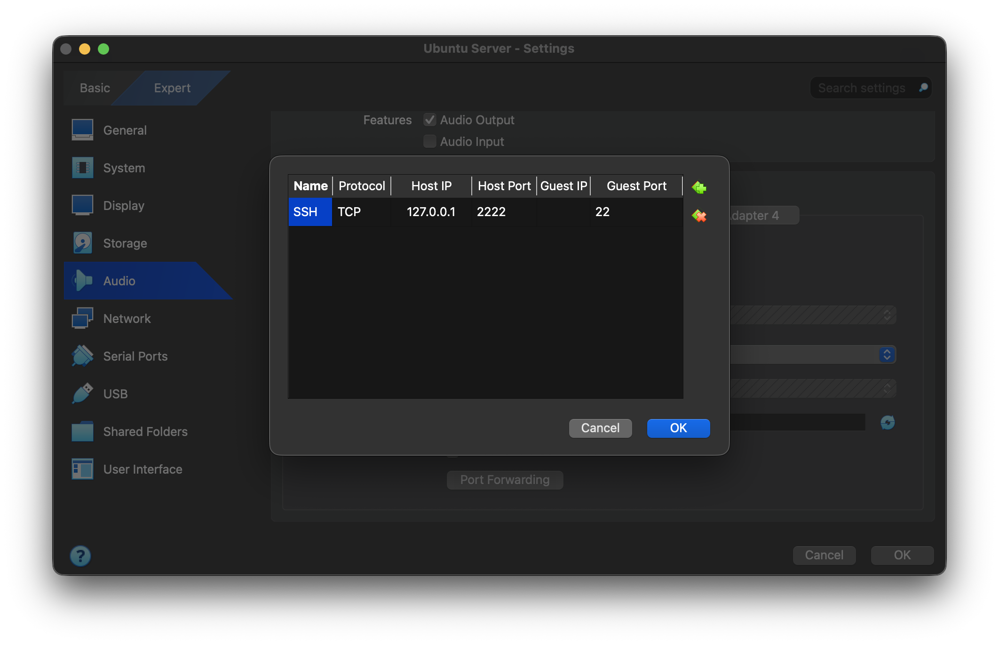

# Semana 2

## O Ambiente de Desenvolvimento

Esta primeira aula pretende essencialmente garantir uma utilização fluida do ambiente de trabalho adoptado
na UC. Isso pressupõe a utilização do `github` (em particular, do repositório atribuído ao grupo de trabalho), e
do ambiente `Python` (versão 3.10 ou superior). Atente, em particular, às 
instruções presentes na secção [Organização do Repositório](#organização-do-repositório).

> **Nota**: Sempre que solicitado, preserve o nome do programa e a ordem dos argumentos. Os programas submetidos serão testados automáticamente numa primeira fase de avaliação do Guião.

### Configuração git

Para configurar o `git` localmente, execute os seguintes comandos no terminal:

```bash
git config --global user.name "Nome Aluno"
git config --global user.email "email@exemplo.com"
```

Após a configuração, pode efetuar o `clone` o repositório do seu grupo:

```bash
git clone <url-do-repositorio>
cd 2526-GXY
```

A configuração atual do git pode ser consultado utilizando o comando seguinte:

```bash
git config --list
```

Para mais informações sobre configurações adicionais, consulte a [documentação oficial do git](https://git-scm.com/doc).


### Instalação Python

A versão mais recente pode ser instalada utilizando os comandos seguintes:

```bash
# macOS
brew install python3

# Ubuntu
sudo apt update
sudo apt install python3
```

#### Verificar versão instalada

Para verificar a versão instalada:

```bash
python3 --version
```

Certifique-se de que a versão é 3.10 ou superior.

## Instalação de bibliotecas de suporte

A biblioteca criptográfica que iremos usar maioritariamente no curso é `cryptography`. Trata-se de uma biblioteca
para a linguagem Python bem desenhada e bem documentada que oferece uma API de alto nível a diferentes
“Serviços Criptográficos” (_recipes_). No entanto, e no âmbito concreto deste curso, iremos fazer um uso
"menos standard" dessa biblioteca, na medida em que iremos recorrer directamente à funcionalidade de baixo nível.

Sugere-se que se siga o método recomendado no [pip de instalação](https://cryptography.io/en/latest/installation/).

```
pip3 install --upgrade pip
pip3 install cryptography
```

#### Validação da instalação

Para verificar a instalação, sugere-se executar o *snippet* de código apresentado na página inicial da biblioteca [cryptography](https://cryptography.io/en/stable/). Neste momento pretende-se apenas validar que são apresentados os *resultados esperados*, sendo que ao longo das próximas aulas iremos ter uma percepção mais abrangente da funcionalidade criptográfica que está a ser executada nesse *snippet*.

## Multipass

O [multipass](https://canonical.com/multipass) é uma ferramenta que permite criar e gerir máquinas virtuais de forma simples e eficiente. É especialmente útil para âmbito desta unidade curricular para casos em que se pretende alterar configurações do sistema operativo ou efetuar experiências com mecanismos de segurança ou controlo de acesso que possam corromper ou provocar alterações indesajadas. Essencialmente, é possibilitada a criação de ambientes "descartáveis".

### Instalação

Para instalar o multipass em macOS, deverão executar o seguinte comando:

```bash
# macOS
brew install --cask multipass

# Ubuntu
sudo snap install multipass
```

Para mais informação, podem consultar a página oficial [aqui]((https://canonical.com/multipass/install)).

### Utilização

Após a instalação, pode criar uma nova instância no multipass com o seguinte comando (sugere-se a utilização da imagem da versão 22.04 LTS):

```bash
# jammy -> alias para Ubuntu 22.04 LTS
multipass launch jammy --name nome-da-instancia
```

Para aceder a uma instância criada, utilize o seguinte comando:

```bash
multipass shell nome-da-instancia
```

Para listar todas as instâncias em execução:

```bash
multipass list
```

Para parar uma instância, execute:

```bash
multipass stop nome-da-instancia
```

Para eliminar uma istância, são necessários os seguintes comandos:

```bash
multipass delete nome-da-instancia
multipass purge
```

Com o Multipass, podemos facilmente gerir ambientes virtuais para efeitos de desenvolvimento e testes.

## VirtualBox

O [VirtualBox](https://www.virtualbox.org/) é uma ferramenta de virtualização que permite criar e gerir máquinas virtuais completas. Ao contrário do multipass, oferece maior flexibilidade e controlo sobre o sistema operativo hóspede, sendo adequado para cenários mais complexos ou cenários em que pretendemos uma interface gráfica.

### 1. Instalação


O VirtualBox pode ser [descarregado](https://www.virtualbox.org/wiki/Downloads) diretamente do website oficial.

Em alternativa, podem instalar o VirtualBox em macOS ou Ubuntu, executando os comandos:

```bash
# macOS
brew install --cask virtualbox

# Ubuntu
sudo apt update
sudo apt install virtualbox
```

### 2. Descarregar ISO

De seguida, deverão descarregar o ficheiro `.iso` da última versão LTS do Ubuntu Server [aqui](https://ubuntu.com/download/server).

### 3. Criar uma nova VM

Para criar uma nova máquina virtual:

1. Abra o VirtualBox e clique em "Nova"
2. Defina o nome e selecione o ficheiro `.iso` descarregado anteriormente
3. Aloque os recursos para a VM (mínimo 2GB RAM recomendado, 1 CPU, 25GB disco)
4. Preencha as definições na secção `Unnatended Install` e selecione as `Guest Additions`
5. Confirme as definições e crie a VM
6. Após a criação da VM, poderá ser necessário executar o comando `sudo poweroff`

### 4. Terminar a instalação

1. Atualizar o sistema operativo
```bash
sudo apt update
sudo apt upgrade
```

2. Instalar `openssh-server`

```bash
sudo apt install openssh-server
```

3. Ativar e lançar o serviço

```bash
sudo systemctl enable ssh
sudo systemctl start ssh
```

4. Verificar o estado do serviço

```bash
sudo systemctl status ssh
```

5. Desligar a máquina

```bash
poweroff
```

### 5. Configuração de port-forwarding para acesso via ssh

1. Desligue a VM

2. Na configuração de rede, crie a regra:



3. Inicie a VM

4. No terminal da sua máquina, execute o comando:

```bash
ssh <username>@127.0.0.1 -p 2222
```

5. Doravante, poderá conectar-se à máquina virtual via ssh


## Organização do Repositório

Todos os grupos terão acesso a um repositório partilhado entre os elementos. A estrutura do mesmo deverá serguir o exemplo a seguir, sendo imperativo que a mesma seja preservada ao longo do semestre para efeitos de avaliação automática.

```
2526-GXY/
├── guioes/
│   │
│   ├── S2/
│   │   ├── a100001/
│   │   ├── a100002/
│   │   └── a100003/
│   │
│   ├── S3/
│   │   ├── a100001/
│   │   ├── a100002/
│   │   └── a100003/
│   │
│   └── ...
│
├── trabalho-pratico/
├── .gitignore
└── README.md
```

> **Nota**: A submissão dos exercícios por parte dos alunos é de cariz facultativo.

## Exercício de Exemplo

Nas respostas às questões colocadas nos guiões, é muito importante:
 - seguir estritamente as indicações do enunciado referentes ao nome do programa; opções da linha de comando; formato dos dados de entrada/saida; etc.
 - testar/validar o programa com o(s) exemplo(s) fornecidos.

**Opcional**: Cada aluno que pretenda efetuar a submissão, deverá criar um ficheiro `.md` com o nome do guião a qual está associado (neste caso, `S2.md`). Questões deverão ser respondidas nestes ficheiros, enquanto programas desenvolvidos deverão ser colocados nas diretorias utilizando os nomes pedidos.

### Exercício 1: `Q1`

**Questão 1:** Qual a versão da biblioteca `cryptography` instalada?

Note que pode executar o comando apresentado abaixo para verificar a versão da biblioteca instalada: 

```bash
$ python3  -c "import cryptography; print(cryptography.__version__)"
```

> **Nota:**
> Deverá ser algo próximo de `42.0.2`

### Exercício 2: `wc.py`

Para testar o ambiente de desenvolvimento e a instalação do `Python`, escreva um pequeno programa `wc.py` que emule uma versão simplificada do comando `wc` do *Unix*, que conta o número de linhas, palavras e caracteres de um ficheiro passado como argumento. Exemplo:

```bash
$ python wc.py exemplo.txt
     580    3518   21268
```

Como *template* da *script* pedida pode adaptar algo semelhante a:

```Python
import sys

# defs auxiliares...
 
def main(inp):
    """ Função que executa a funcionalidade pretendida... """
    print("Argumentos da linha de comando: ", inp)

# Se for chamada como script...
if __name__ == "__main__":
    main(sys.argv)
```